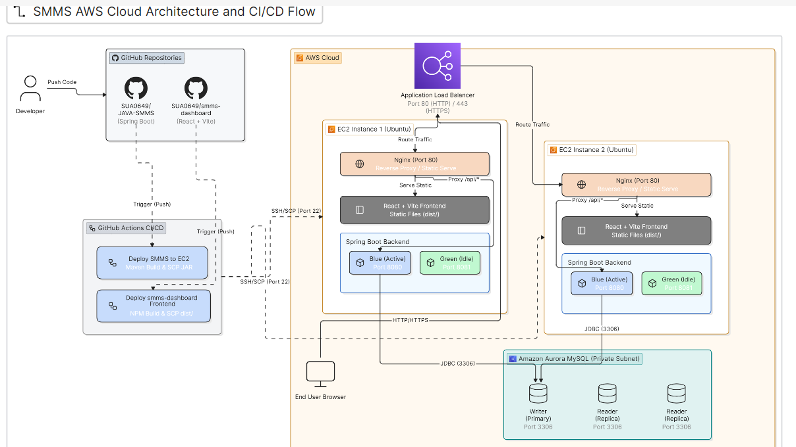

# JAVA-SMMS — Backend

> Spring Boot REST API for the Social Media Management System (SMMS ERP Dashboard).

---

## Table of Contents

| #  | Section                                                              |
|----|----------------------------------------------------------------------|
| 1  | [Prerequisites](#1-prerequisites)                                    |
| 2  | [Clone the Repository](#2-clone-the-repository)                      |
| 3  | [Run Locally](#3-run-locally)                                        |
| 4  | [Create an EC2 Instance](#4-create-an-ec2-instance)                  |
| 5  | [SSH into the EC2 Instance](#5-ssh-into-the-ec2-instance)            |
| 6  | [Install Dependencies on EC2](#6-install-dependencies-on-ec2)        |
| 7  | [Clone & Test on EC2](#7-clone--test-on-ec2)                         |
| 8  | [Configure Nginx](#8-configure-nginx)                                |
| 9  | [Create the Blue-Green Deployment Script](#9-create-the-blue-green-deployment-script) |
| 10 | [Create Systemd Services](#10-create-systemd-services)               |
| 11 | [Test in the Browser](#11-test-in-the-browser)                       |
| 12 | [Run the GitHub Actions Workflow](#12-run-the-github-actions-workflow)|
| 13 | [Final Verification](#13-final-verification)                         |

---

## 1. Prerequisites

Make sure you have the following installed on your **local machine**:

| Tool   | Version           | Purpose              |
|--------|-------------------|----------------------|
| Git    | Latest            | Version control      |
| JDK    | 26                | Java runtime         |
| Maven  | 3.9+ (or use `mvnw`) | Build tool        |
| MySQL  | 8.0+              | Database             |

### Environment Variables

The application reads its configuration from environment variables. Set these before running:

| Variable      | Description                                   | Example                                          |
|---------------|-----------------------------------------------|--------------------------------------------------|
| `DB_URL`      | JDBC connection string                        | `jdbc:mysql://localhost:3306/smms_db`             |
| `DB_USERNAME` | Database username                             | `root`                                           |
| `DB_PSWD`     | Database password                             | `your_password`                                  |
| `TOKEN`       | JWT signing secret key                        | `your-256-bit-secret`                            |

---

## 2. Clone the Repository

```bash
git clone https://github.com/SUA0649/JAVA-SMMS.git
cd JAVA-SMMS
```

---

## 3. Run Locally

### 3.1 Set Up the Database

```sql
CREATE DATABASE smms_db;
```

> JPA is configured with `ddl-auto=update`, so tables will be created automatically on first run.

### 3.2 Export Environment Variables

**Linux / macOS:**

```bash
export DB_URL=jdbc:mysql://localhost:3306/smms_db
export DB_USERNAME=root
export DB_PSWD=your_password
export TOKEN=your-256-bit-secret
```

**Windows (PowerShell):**

```powershell
$env:DB_URL = "jdbc:mysql://localhost:3306/smms_db"
$env:DB_USERNAME = "root"
$env:DB_PSWD = "your_password"
$env:TOKEN = "your-256-bit-secret"
```

### 3.3 Build & Run

```bash
./mvnw clean package -DskipTests
java -jar target/smms-0.0.1-SNAPSHOT.jar
```

Or run directly with Maven:

```bash
./mvnw spring-boot:run
```

The API will start on **`http://localhost:8080`**.

### 3.4 Verify the Health Endpoint

```bash
curl http://localhost:8080/actuator/health
```

Expected response:

```json
{ "status": "UP" }
```

---

## 4. Create an EC2 Instance

### 4.1 Launch the Instance

1. Open **AWS Console → EC2 → Launch Instance**.
2. Configure:
   - **Name:** `smms-backend`
   - **AMI:** Ubuntu Server 24.04 LTS
   - **Instance Type:** `t2.micro` (free-tier) or `t2.small`
   - **Key Pair:** Create or select an existing key pair — **download the `.pem` file** and keep it safe.

### 4.2 Configure Security Group

Set the following **Inbound Rules**:

| Type        | Protocol | Port  | Source     | Purpose                             |
|-------------|----------|-------|------------|-------------------------------------|
| SSH         | TCP      | 22    | Your IP    | SSH access                          |
| HTTP        | TCP      | 80    | 0.0.0.0/0  | Nginx — frontend + API proxy       |
| Custom TCP  | TCP      | 8080  | 0.0.0.0/0  | Spring Boot — Blue instance        |
| Custom TCP  | TCP      | 8081  | 0.0.0.0/0  | Spring Boot — Green instance       |
| Custom TCP  | TCP      | 5173  | 0.0.0.0/0  | Vite dev server (temporary only)    |

> **Important:** Ports `8080` and `8081` are used by the blue-green deployment strategy. Port `5173` is only needed temporarily for frontend dev testing — remove it once Nginx is confirmed working.

### 4.3 Allocate an Elastic IP *(Recommended)*

1. Go to **EC2 → Elastic IPs → Allocate Elastic IP address**.
2. Associate it with your instance.
3. This gives you a **static public IP** that won't change on restart.

---

## 5. SSH into the EC2 Instance

### 5.1 Option A — Terminal / PowerShell

```bash
chmod 400 your-key.pem
ssh -i "your-key.pem" ubuntu@<EC2-PUBLIC-IP>
```

### 5.2 Option B — MobaXterm

1. Open **MobaXterm** → click **Session** → select **SSH**.
2. Fill in:
   - **Remote host:** `<EC2-PUBLIC-IP>`
   - **Username:** `ubuntu`
3. Under **Advanced SSH Settings** → check **Use private key** → browse to your `.pem` file.
4. Click **OK** to connect.

---

## 6. Install Dependencies on EC2

Run the following commands after connecting.

### 6.1 Update System Packages

```bash
sudo apt update
```

### 6.2 Install OpenJDK 26

```bash
sudo apt install -y openjdk-26-jdk
```

Verify:

```bash
java -version
```

### 6.3 Install Node.js & npm

*(Required for the frontend — same instance hosts both)*

```bash
curl -fsSL https://deb.nodesource.com/setup_22.x | sudo -E bash -
sudo apt install -y nodejs
```

Verify:

```bash
node -v
npm -v
```

### 6.4 Install Nginx

```bash
sudo apt install -y nginx
```

Verify:

```bash
sudo systemctl status nginx
```

### 6.5 Install Git

```bash
sudo apt install -y git
```

### 6.6 Install MySQL Client *(Optional — for debugging)*

```bash
sudo apt install -y mysql-client
```

---

## 7. Clone & Test on EC2

### 7.1 Clone the Repository

```bash
cd ~
git clone https://github.com/SUA0649/JAVA-SMMS.git smms
cd smms
```

### 7.2 Set Environment Variables

```bash
export DB_URL=jdbc:mysql://<RDS-OR-DB-HOST>:3306/smms_db
export DB_USERNAME=your_db_user
export DB_PSWD=your_db_password
export TOKEN=your-256-bit-secret
```

> **Tip:** To persist these across reboots, add them to `~/.bashrc` or use them directly in the systemd service files (Section 10).

### 7.3 Build the JAR

```bash
chmod +x mvnw
./mvnw clean package -DskipTests
```

### 7.4 Test Run

```bash
java -jar target/smms-0.0.1-SNAPSHOT.jar --server.port=8080
```

Open your browser and go to:

```
http://<EC2-PUBLIC-IP>:8080/actuator/health
```

You should see `{"status":"UP"}`. Stop it with **`Ctrl + C`** once confirmed.

---

## 8. Configure Nginx

This Nginx config serves **both** the frontend (static files) and reverse-proxies the backend API. It is the **same config** used by the frontend `smms-dashboard` project.

### 8.1 Create the Nginx Site Configuration

```bash
sudo nano /etc/nginx/sites-available/smms
```

Paste the following:

```nginx
server {
    listen 80;
    server_name <EC2-PUBLIC-IP>;    # TODO: Replace with your EC2 public IP or domain

    # ───────── Frontend (Vite Production Build) ─────────
    root /home/ubuntu/smms-dashboard/dist;
    index index.html;

    location / {
        try_files $uri $uri/ /index.html;
    }

    # ───────── Backend API Reverse Proxy ─────────
    location /api/ {
        proxy_pass         http://backend;
        proxy_set_header   Host $host;
        proxy_set_header   X-Real-IP $remote_addr;
        proxy_set_header   X-Forwarded-For $proxy_add_x_forwarded_for;
        proxy_set_header   X-Forwarded-Proto $scheme;
    }

    # ───────── Error Pages ─────────
    error_page 500 502 503 504 /50x.html;
    location = /50x.html {
        root /usr/share/nginx/html;
    }
}
```

> **Note:** Replace `<EC2-PUBLIC-IP>` in the `server_name` line with your actual EC2 public IP or domain.

### 8.2 Enable the Site & Remove Default

```bash
sudo ln -s /etc/nginx/sites-available/smms /etc/nginx/sites-enabled/
sudo rm -f /etc/nginx/sites-enabled/default
```

### 8.3 Test & Restart Nginx

```bash
sudo nginx -t
sudo systemctl restart nginx
```

Expected output from `nginx -t`:

```
nginx: the configuration file /etc/nginx/nginx.conf syntax is ok
nginx: configuration file /etc/nginx/nginx.conf test is successful
```

---

## 9. Create the Blue-Green Deployment Script

The backend uses a **blue-green deployment strategy** to achieve **zero-downtime deploys**. Two instances of the app alternate between ports `8080` (blue) and `8081` (green). On each deploy, the new JAR starts on the inactive port, and once healthy, Nginx switches traffic to it and the old instance is stopped.

### 9.1 Create `deploy-backend.sh`

```bash
sudo nano /home/ubuntu/deploy-backend.sh
```

Paste the following:

```bash
#!/bin/bash
set -e

APP_DIR="/home/ubuntu/smms"
UPSTREAM_CONF="/etc/nginx/conf.d/smms-backend.conf"

# Determine which target is currently active in NGINX
if grep -q "8080" "$UPSTREAM_CONF"; then
    CURRENT_COLOR="blue"
    CURRENT_PORT="8080"
    NEW_COLOR="green"
    NEW_PORT="8081"
else
    CURRENT_COLOR="green"
    CURRENT_PORT="8081"
    NEW_COLOR="blue"
    NEW_PORT="8080"
fi

echo "=========================================="
echo " Active Color : $CURRENT_COLOR ($CURRENT_PORT)"
echo " Target Color : $NEW_COLOR ($NEW_PORT)"
echo "=========================================="

# 1. Move new build JAR into place for the target service
cp "$APP_DIR/target-new.jar" "$APP_DIR/smms-$NEW_COLOR.jar"

# 2. Start the target systemd service
echo "Starting smms-$NEW_COLOR service on port $NEW_PORT..."
sudo systemctl restart "smms-$NEW_COLOR"

# 3. Health Check Loop: Poll Actuator until 200 OK is returned
echo "Waiting for Spring Boot to complete startup on port $NEW_PORT..."
MAX_ATTEMPTS=30
ATTEMPT=0
HEALTH_URL="http://127.0.0.1:$NEW_PORT/actuator/health"

while [ $ATTEMPT -lt $MAX_ATTEMPTS ]; do
    HTTP_STATUS=$(curl -s -o /dev/null -w "%{http_code}" "$HEALTH_URL" || true)

    if [ "$HTTP_STATUS" -eq 200 ]; then
        echo "Health check passed! Service on port $NEW_PORT is online."
        break
    fi

    ATTEMPT=$((ATTEMPT + 1))
    echo "Waiting for backend startup... Attempt $ATTEMPT/$MAX_ATTEMPTS (Status: $HTTP_STATUS)"
    sleep 2
done

if [ $ATTEMPT -eq $MAX_ATTEMPTS ]; then
    echo "ERROR: Health check failed on port $NEW_PORT. Aborting deployment."
    sudo systemctl stop "smms-$NEW_COLOR"
    exit 1
fi


echo "=========================================="
echo " Active Color : $CURRENT_COLOR ($CURRENT_PORT)"
echo " Target Color : $NEW_COLOR ($NEW_PORT)"
echo "=========================================="

# 1. Move new build JAR into place for the target service
cp "$APP_DIR/target-new.jar" "$APP_DIR/smms-$NEW_COLOR.jar"

# 2. Start the target systemd service
echo "Starting smms-$NEW_COLOR service on port $NEW_PORT..."
sudo systemctl restart "smms-$NEW_COLOR"

# 3. Health Check Loop: Poll Actuator until 200 OK is returned
echo "Waiting for Spring Boot to complete startup on port $NEW_PORT..."
MAX_ATTEMPTS=30
ATTEMPT=0
HEALTH_URL="http://127.0.0.1:$NEW_PORT/actuator/health"

while [ $ATTEMPT -lt $MAX_ATTEMPTS ]; do
    HTTP_STATUS=$(curl -s -o /dev/null -w "%{http_code}" "$HEALTH_URL" || true)

    if [ "$HTTP_STATUS" -eq 200 ]; then
        echo "Health check passed! Service on port $NEW_PORT is online."
        break
    fi

    ATTEMPT=$((ATTEMPT + 1))
    echo "Waiting for backend startup... Attempt $ATTEMPT/$MAX_ATTEMPTS (Status: $HTTP_STATUS)"
    sleep 2
done

if [ $ATTEMPT -eq $MAX_ATTEMPTS ]; then
    echo "ERROR: Health check failed on port $NEW_PORT. Aborting deployment."
    sudo systemctl stop "smms-$NEW_COLOR"
    exit 1
fi

# 4. Atomic NGINX Switch
echo "Updating NGINX upstream to port $NEW_PORT..."
echo "upstream smms_backend { server 127.0.0.1:$NEW_PORT; }" | sudo tee "$UPSTREAM_CONF" > /dev/null

# 5. Reload NGINX (Zero Downtime)
sudo systemctl reload nginx
echo "NGINX reloaded. Traffic routed to $NEW_COLOR ($NEW_PORT)."

# 6. Gracefully stop old service
echo "Stopping old smms-$CURRENT_COLOR service..."
sudo systemctl stop "smms-$CURRENT_COLOR"

echo "Zero-downtime deployment complete!"


```

### 9.2 Make It Executable

```bash
sudo chmod +x /home/ubuntu/deploy-backend.sh
```

---

## 10. Create Systemd Services

Two systemd services are needed — one for **blue** (port `8080`) and one for **green** (port `8081`).

### 10.1 Blue Service (Port 8080)

```bash
sudo nano /etc/systemd/system/smms-blue.service
```

Paste:

```ini
[Unit]
Description=SMMS Backend — Blue Instance (Port 8080)
After=network.target

[Service]
Type=simple
User=ubuntu
WorkingDirectory=/home/ubuntu/smms
ExecStart=/usr/bin/java -jar /home/ubuntu/smms/smms-blue.jar --server.port=8080
Restart=on-failure
RestartSec=10

Environment=DB_URL=jdbc:mysql://<DB-HOST>:3306/smms_db
Environment=DB_USERNAME=<DB-USER>
Environment=DB_PSWD=<DB-PASSWORD>
Environment=TOKEN=<JWT-SECRET>

[Install]
WantedBy=multi-user.target
```

### 10.2 Green Service (Port 8081)

```bash
sudo nano /etc/systemd/system/smms-green.service
```

Paste:

```ini
[Unit]
Description=SMMS Backend — Green Instance (Port 8081)
After=network.target

[Service]
Type=simple
User=ubuntu
WorkingDirectory=/home/ubuntu/smms
ExecStart=/usr/bin/java -jar /home/ubuntu/smms/smms-green.jar --server.port=8081
Restart=on-failure
RestartSec=10

Environment=DB_URL=jdbc:mysql://<DB-HOST>:3306/smms_db
Environment=DB_USERNAME=<DB-USER>
Environment=DB_PSWD=<DB-PASSWORD>
Environment=TOKEN=<JWT-SECRET>

[Install]
WantedBy=multi-user.target
```

> **Important:** Replace all `<DB-HOST>`, `<DB-USER>`, `<DB-PASSWORD>`, and `<JWT-SECRET>` placeholders with your actual values.

### 10.3 Enable & Start the Initial Service

```bash
sudo systemctl daemon-reload
sudo systemctl enable smms-blue
sudo systemctl start smms-blue
```

Verify:

```bash
sudo systemctl status smms-blue
```

> Only **one** service (blue or green) runs at a time. The deploy script handles the swap.

---

## 11. Test in the Browser

Open your browser and navigate to:

```
http://<EC2-PUBLIC-IP>
```

**Checklist:**

- [ ] Login page loads (frontend served by Nginx)
- [ ] `http://<EC2-PUBLIC-IP>/actuator/health` returns `{"status":"UP"}`
- [ ] Login works — API call to `/api/v1/auth/login` succeeds
- [ ] Dashboard page loads after login
- [ ] Navigation to Users, Accounts, Campaigns, Invoices, Assets, Inventory, Sponsorships all work
- [ ] Page refresh on any sub-route does **not** return 404

> **Troubleshooting — 502 Bad Gateway:**
> The backend isn't running. Check which service is active:
> ```bash
> sudo systemctl status smms-blue
> sudo systemctl status smms-green
> ```
> Check application logs:
> ```bash
> sudo journalctl -u smms-blue -f
> sudo journalctl -u smms-green -f
> ```

> **Troubleshooting — Database Connection Refused:**
> Verify your `DB_URL` is correct and the database is reachable from the EC2 instance:
> ```bash
> mysql -h <DB-HOST> -u <DB-USER> -p
> ```

> **Troubleshooting — 403 Forbidden (Nginx):**
> ```bash
> sudo chmod +x /home/ubuntu
> sudo chmod -R 755 /home/ubuntu/smms-dashboard/dist
> ```

---

## 12. Run the GitHub Actions Workflow

The project includes a CI/CD workflow at `.github/workflows/deploy.yml` that builds the JAR and deploys it to **two EC2 instances** using the blue-green strategy.

### 12.1 Configure Repository Secrets

Go to **GitHub → Repository → Settings → Secrets and variables → Actions** and add:

| Secret Name      | Value                                               |
|------------------|-----------------------------------------------------|
| `EC2_HOST_1`     | Public IP of EC2 Instance 1 (e.g. `34.226.205.162`) |
| `EC2_HOST_2`     | Public IP of EC2 Instance 2 (e.g. `98.84.152.26`)   |
| `EC2_USERNAME`   | `ubuntu`                                            |
| `EC2_SSH_KEY`    | Full contents of your `.pem` private key file       |

### 12.2 Trigger the Workflow

**Automatic:** Push to the `master` branch.

```bash
git add .
git commit -m "your commit message"
git push origin master
```

**Manual:** Go to the **Actions** tab → select **"Deploy SMMS to EC2"** → click **Run workflow**.

### 12.3 What the Workflow Does

```
┌─────────────────────────────────────────────────────────┐
│  1. Checkout code                                       │
│  2. Set up Java 26 (Temurin) with Maven cache           │
│  3. chmod +x mvnw                                       │
│  4. ./mvnw clean package -DskipTests                    │
│  5. SCP smms-0.0.1-SNAPSHOT.jar → /home/ubuntu/smms/    │
│  6. Rename to target-new.jar                            │
│  7. chmod +x deploy-backend.sh && run it                │
│     ├─ Starts new JAR on inactive port (blue/green)     │
│     ├─ Waits for /actuator/health → 200                 │
│     ├─ Switches Nginx proxy_pass to new port            │
│     └─ Stops the old instance                           │
│  8. Repeat steps 5–7 for Instance 2                     │
└─────────────────────────────────────────────────────────┘
```

### 12.4 Monitor for Errors

1. Go to the **Actions** tab in your GitHub repository.
2. Click on the latest workflow run.
3. All steps should show a **green check ✅**.
4. If any step fails, click on it to expand the logs and debug.

---

## 13. Final Verification

After the GitHub Actions workflow completes:

1. **Open your browser** and go to:

   ```
   http://<EC2-PUBLIC-IP>
   ```

2. **Hard refresh** with `Ctrl + Shift + R` to bypass cached assets.

3. **Test the full flow:**
   - Login → Dashboard → navigate through all pages
   - Create / update / delete a record to test write operations
   - Confirm the health endpoint is still responding

4. **Verify the blue-green swap:**

   ```bash
   # SSH into the instance and check which service is active
   sudo systemctl status smms-blue
   sudo systemctl status smms-green
   
   # Check which port Nginx is proxying to
   grep proxy_pass /etc/nginx/sites-available/smms-dashboard
   ```

> **If changes aren't reflected**, SSH in and re-run the deploy script:
> ```bash
> sudo /home/ubuntu/deploy-backend.sh
> ```

---

## Quick Reference

| Action                        | Command                                              |
|-------------------------------|------------------------------------------------------|
| Build the JAR                 | `./mvnw clean package -DskipTests`                   |
| Run locally                   | `java -jar target/smms-0.0.1-SNAPSHOT.jar`           |
| Check blue service            | `sudo systemctl status smms-blue`                    |
| Check green service           | `sudo systemctl status smms-green`                   |
| View blue logs                | `sudo journalctl -u smms-blue -f`                    |
| View green logs               | `sudo journalctl -u smms-green -f`                   |
| Restart blue                  | `sudo systemctl restart smms-blue`                   |
| Restart green                 | `sudo systemctl restart smms-green`                  |
| Run deploy script             | `sudo /home/ubuntu/deploy-backend.sh`                |
| Test Nginx config             | `sudo nginx -t`                                      |
| Restart Nginx                 | `sudo systemctl restart nginx`                       |
| Reload Nginx (no downtime)    | `sudo systemctl reload nginx`                        |
| View Nginx error log          | `sudo tail -f /var/log/nginx/error.log`              |
| Check health (blue)           | `curl http://localhost:8080/actuator/health`          |
| Check health (green)          | `curl http://localhost:8081/actuator/health`          |
| Check active proxy port       | `grep proxy_pass /etc/nginx/sites-available/smms-dashboard` |
| Pull latest code on EC2       | `cd ~/smms && git pull origin master`                |

---

## Architecture Overview

```
                        ┌──────────────┐
                        │   Browser    │
                        └──────┬───────┘
                               │ :80
                        ┌──────▼───────┐
                        │    Nginx     │
                        │  (port 80)   │
                        └──┬───────┬───┘
                  /        │       │       /api/*
          ┌────────────────┘       └────────────────┐
          ▼                                         ▼
  ┌───────────────┐                     ┌───────────────────┐
  │   Frontend    │                     │  Spring Boot API  │
  │  (dist/ dir)  │                     │  Blue  :8080      │
  │  static files │                     │   OR              │
  └───────────────┘                     │  Green :8081      │
                                        └─────────┬─────────┘
                                                  │
                                          ┌───────▼───────┐
                                          │    MySQL DB   │
                                          └───────────────┘
```
